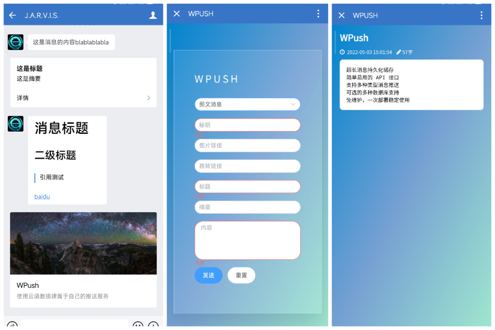

<div align=center></div>

<h1 align="center">WPush</h1>
<h6 align="center">使用云函数搭建属于自己的推送服务</h6>


## Feature
- :tada: 超长消息持久化储存
- :tada: 简单易用的 API 接口
- :tada: 支持多种类型消息推送
- :tada: 可选的多数据库（MongoDB/MySQL）支持
- :tada: 免维护，一次部署稳定使用


## Get Started
### 发送消息

> GET请求可能会因消息内容过长而无法全部显示，如需长文推送请使用POST方法  
> 配置数据库可以进一步提升消息内容长度
>
> POST请求时使用JSON格式，接口路径均为 **/send** ，参数字段名称与GET请求一致
>
> 更多细节说明请参考[企业微信API](https://developer.work.weixin.qq.com/document/path/90372)

- 参数说明

  |  参数   |                             说明                             | 是否必填 |
  | :-----: | :----------------------------------------------------------: | :------: |
  |  type   |   消息类型，无标题参数时默认text，有标题参数时默认textcard   |    否    |
  |  title  |             消息标题，在textcard、news类型中必填             |  视情况  |
  | content |                           消息内容                           |    否    |
  | summary |            消息摘要，默认消息内容前128个字节内容             |    否    |
  |   url   | 跳转链接，默认展示消息页面，仅textcard、news类型中有效<br>填写时请确保包含协议头（http/https） |    否    |
  |   pic   |         图片链接，默认Bing每日一图，仅news类型中显示         |    否    |
  |  user   | 指定接收消息的成员，成员ID列表<br>默认向该企业应用的全部成员发送 |    否    |
  |   tag   |                指定接收消息的标签，标签ID列表                |    否    |
  |  party  |                指定接收消息的部门，部门ID列表                |    否    |
  
  | type参数 |     说明     |
  | :------: | :----------: |
  |   text   |   文本消息   |
  | textcard | 文本卡片消息 |
  | markdown | markdown消息 |
  |   news   |   图文消息   |
  
  
  
  ### 发送文本消息
  
  - GET
  
    ```
    https://你的云函数地址/send?secret=你配置的密钥&type=text&content=这是消息的内容blablablabla
    ```
  
  - POST
  
    ```json
    {
        "secret": "你配置的密钥",
        "type":"text",
        "content": "这是消息的内容blablablabla"
    }
    ```
  
  
  
  ### 发送文本卡片消息  
  
  - GET
  
    ```
    https://你的云函数地址/send?secret=你配置的密钥&type=textcard&title=这是标题&summary=这是摘要&content=这是消息的内容blablablabla
    ```
  
  - POST
  
    ```json
    {
        "secret": "你配置的密钥",
        "type":"textcard",
        "title":"这是标题",
        "summary":"这是摘要",
        "content": "这是消息的内容blablablabla"
    }
    ```
  
  
  
  ### 发送Markdown消息
  
  - GET
  
    ```
    https://你的云函数地址/send?secret=你配置的密钥&type=markdown&content=这是消息的内容blablablabla
    ```
  
    > 使用GET方法传输markdown语法内容可能会导致content参数无法获取，建议使用POST方法
  
  - POST
  
    ```json
    {
        "secret": "你配置的密钥",
        "type": "markdown",
        "content": "# 消息标题\n## 二级标题\n> 引用测试\n\n[baidu](https://baidu.com)"
    }
    ```
  
  
  
  
  ### 发送图文消息
  
  - GET
  
    ```
    https://你的云函数地址/send?secret=你配置的密钥&type=news&title=这是标题&summary=这是摘要&content=这是消息的内容blablablabla&pic=https://cn.bing.com/th?id=OHR.YosemiteNightSky_ZH-CN5864740024_1920x1080.jpg&url=https://www.baidu.com
    ```
  
  - POST
  
    ```json
    {
        "secret": "你配置的密钥",
        "type": "news",
        "title": "这是标题",
        "summary":"这是摘要",
        "content": "这是消息的内容blablablabla",
        "pic": "https://cn.bing.com/th?id=OHR.YosemiteNightSky_ZH-CN5864740024_1920x1080.jpg",
        "url":"https://www.baidu.com"
    }
    ```
  
    > 暂时只支持单个图文消息推送
    >
    > 跳转链接url可能因微信官方限制而无法访问
  
  
  
  ### 推送给指定成员
  
  - 你可以添加 `user` `tag` `party` 参数来筛选发送的企业成员
  
    ```json
    {
        "user": "USER_ID1|USER_ID2",
        "tag": "TAG_ID1|TAG_ID2",
        "party": "PARTY_ID",
        "secret": "你配置的密钥",
        "type":"textcard",
        "title":"这是标题",
        "content": "这是消息的内容blablablabla"
    }
    ```
  
  - 这些参数也可以是数组：
  
    ```json
    {
        "user": ["USER_ID1", "USER_ID2"],
        "tag": ["TAG_ID1", "TAG_ID2"],
        "party": ["PARTY_ID1", "PARTY_ID2"],
        "secret": "你配置的密钥",
        "type":"textcard",
        "title":"这是标题",
        "content": "这是消息的内容blablablabla"
    }
    ```
  


### 展示消息

> 目前仅提供对卡片消息、图文消息进行展示 

- 使用数据库: `https://你的云函数地址/show/消息ID`
- 未使用数据库: `https://你的云函数地址/show?t=TIME&h=TITLE&c=CONTENT`


## Deployment

> **2022-05-03 更新**：   
> 新增首页发送消息，新增对 **MongoDB** 的支持   
> 修改环境变量中数据库相关参数，请务必修改环境变量再部署
>
> **2022-04-23 更新**：
> 因为腾讯云函数 5 月 23 日后不再提供免费额度，不建议再使用 [腾讯云函数搭建](docs/scf.md)   
>推荐使用 **Vercel** 作为替代，目前已添加对 **Vercel** 的支持

- 参数说明

  |    参数     |                             说明                             | 是否必填 |
  | :---------: | :----------------------------------------------------------: | :------: |
  |   SYS_URL   | 系统访问地址<br>Vercel示例：https://[你起的仓库名]-[你的vercel用户名].vercel.app |    是    |
  | API_SECRET  |   API访问密钥，随意设置<br>发起请求时作为secret属性值携带    |    是    |
  |   CORP_ID   |                        企业微信公司ID                        |    是    |
  | CORP_SECRET |                      企业微信应用Secret                      |    是    |
  |  AGENT_ID   |                        企业微信应用ID                        |    是    |
  |   DB_LINK   | 数据库完整连接地址<br>mysql示例：mysql+mysqlconnector://[数据库用户名]:[数据库密码]@[数据库地址]:3306/[数据库名]?charset=utf8mb4<br>mongodb示例：mongodb+srv://[数据库用户名]:[数据库密码]@[数据库地址]/[数据库名]?retryWrites=true&w=majority |    否    |


- 建议右键点击下方按钮新页面打开链接完成部署

[](https://vercel.com/new/clone?repository-url=https%3A%2F%2Fgithub.com%2Fhyunel%2Fwpush&env=SYS_URL,API_SECRET,CORP_ID,CORP_SECRET,AGENT_ID&envDescription=Configuration%20needed%20for%20WPush&envLink=https%3A%2F%2Fgithub.com%2Fhyunel%2Fwpush%2Fblob%2Fmaster%2Fconfig.py&project-name=wpush&repo-name=wpush)