# SCF 腾讯云函数搭建教程

### Step1
> 从 Releases 页下载最新的代码包

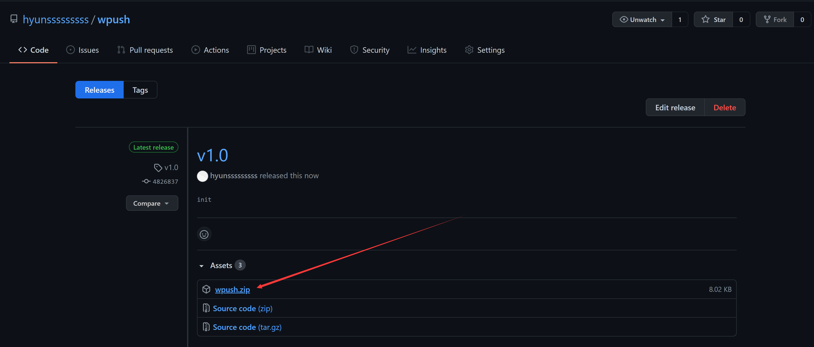

### Step2
> 在腾讯云 Serverless 页新建一个函数服务

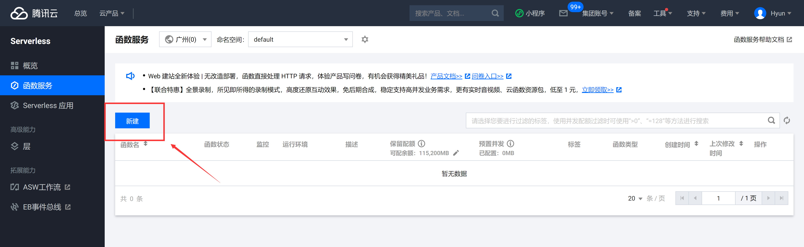

### Step3
> 如图选择自定义创建, 且函数类型保持默认选择**事件函数**

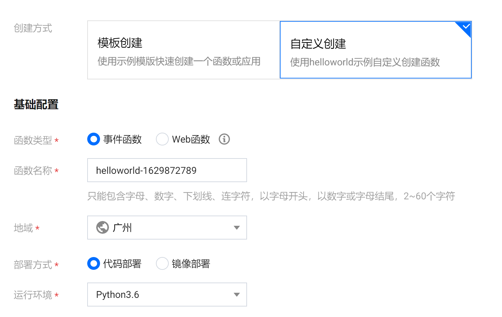

### Step4
> 上传第一步下载的代码包

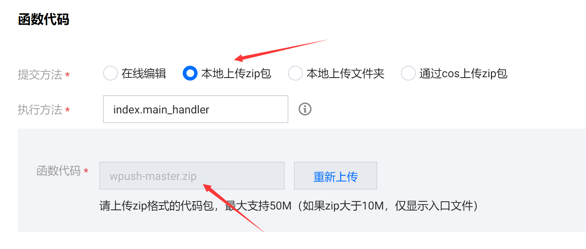

### Step5
> 选择**触发器配置** => 自定义创建, 触发方式选择**API 网关触发**,其他保持默认即可

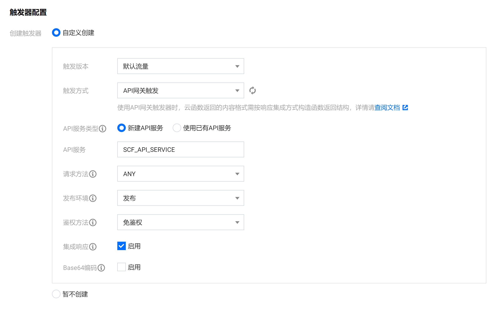

### Step6
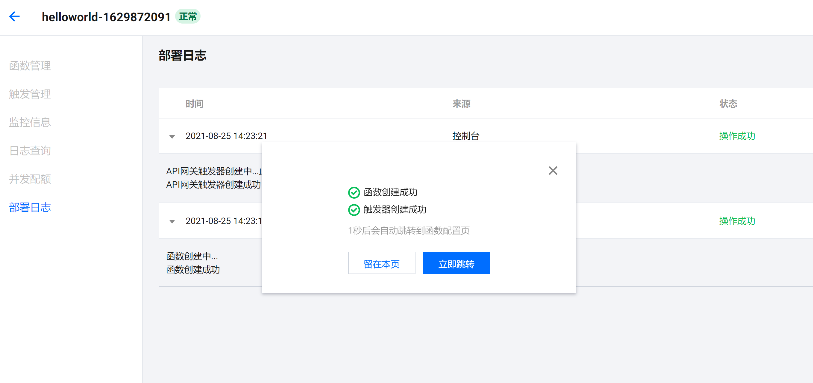
> 创建成功后搜索并打开 **API 网关**

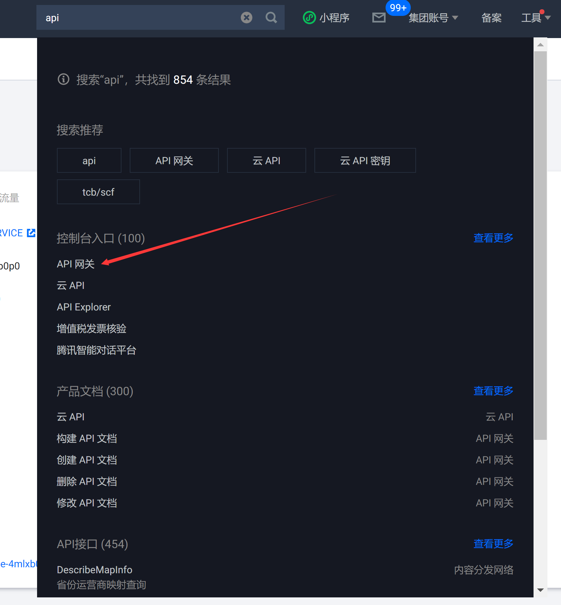

### Step7
> 选择自动创建的开放API 服务, 并单击打开详情

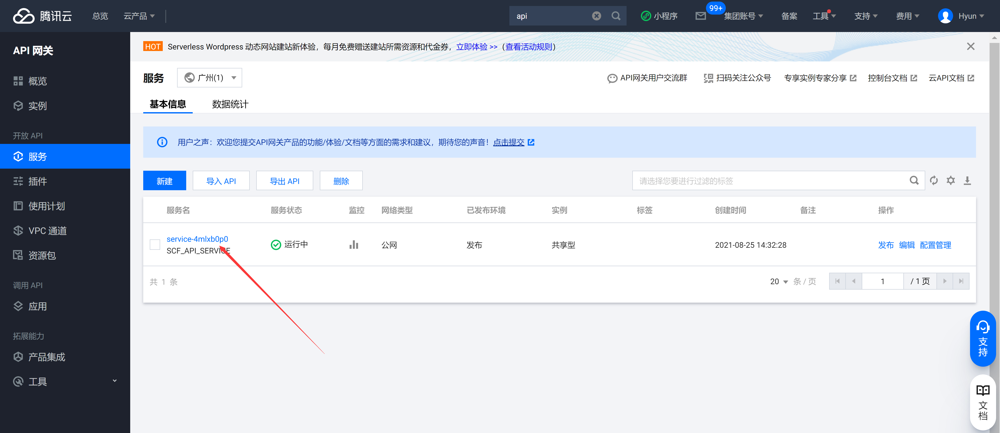

### Step8
> 如图单击**编辑**

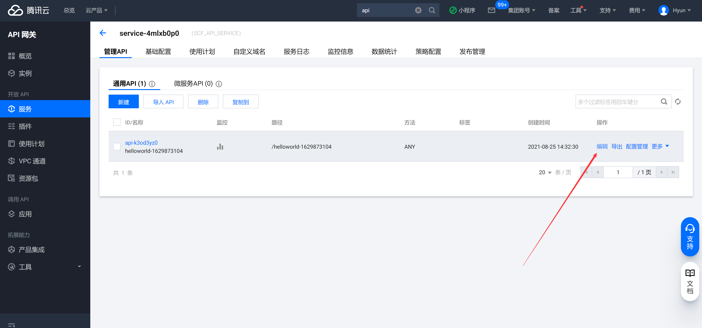

### Step9
> **删除斜杠后面的所有字符, 路径只保留一个斜杠**

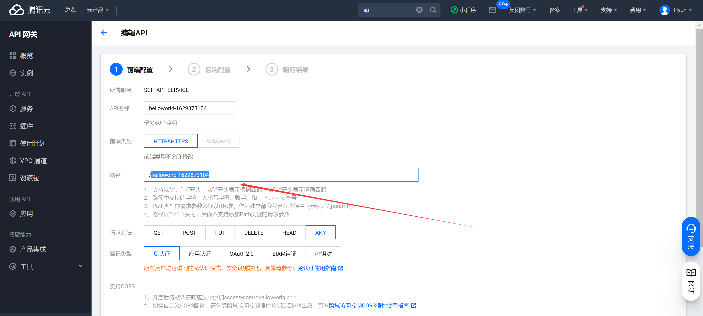

### Step10
> 单击底部的**立即完成**并发布 API

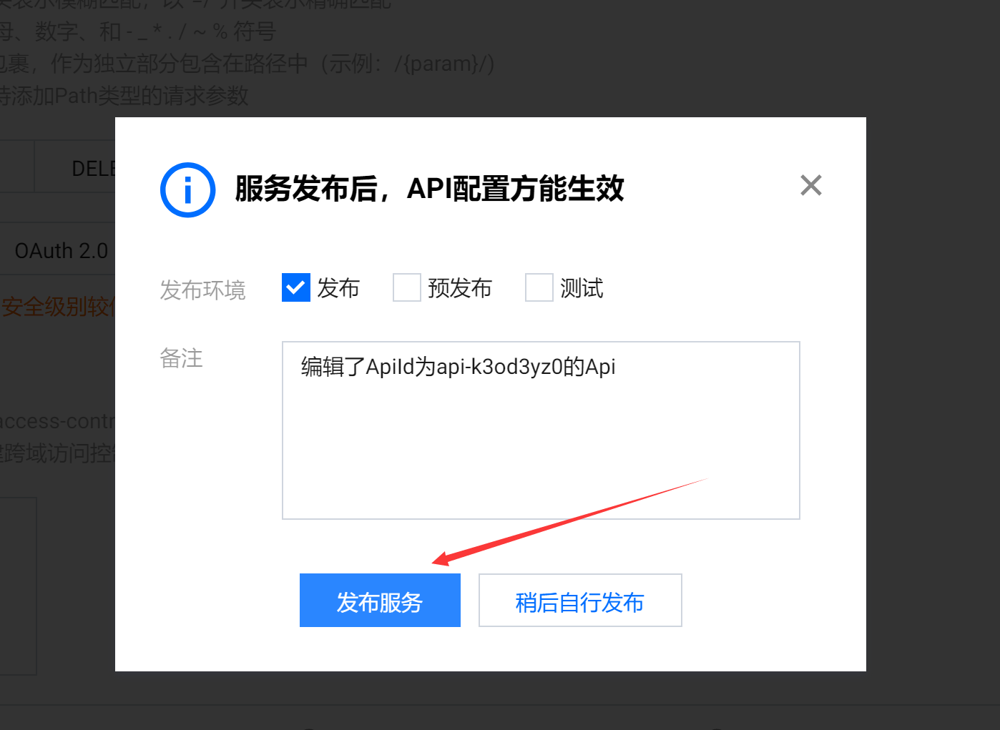

### Step11
> 单击打开详情, 记录地址

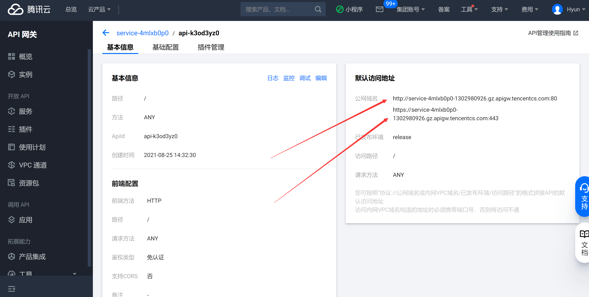

### Step12
> 返回 Serverless 页选中侧边栏**层**, 新建层, 并如图上传层代码(函数代码需要使用到的依赖)

关于层代码的生成可参考[依赖安装](https://cloud.tencent.com/document/product/583/39780#python-.E8.BF.90.E8.A1.8C.E6.97.B6), 这里提供现成的层代码: [点我下载](https://hyunsss.lanzoui.com/iAgogt5db5i)

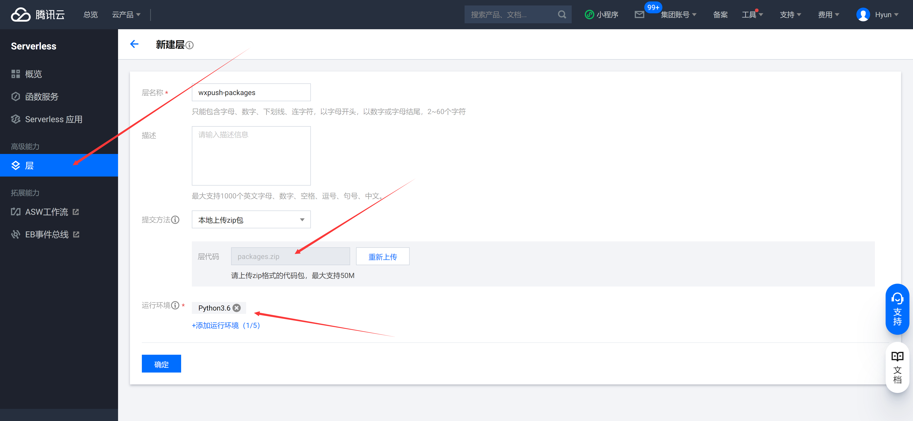

### Step13
> 返回函数服务, 绑定刚刚创建好的层

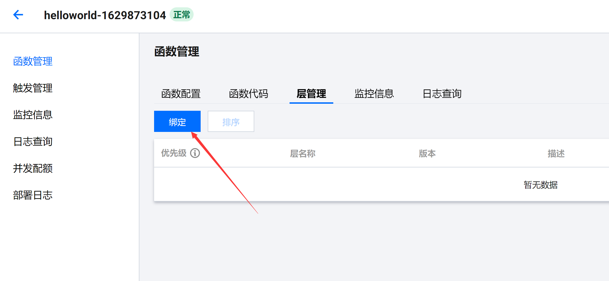

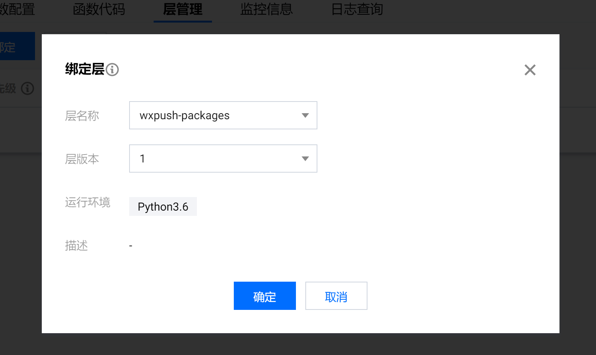

### Step14
> 编辑配置 config.py 并部署, 其中 sys_url 填第 11 步记录的地址即可

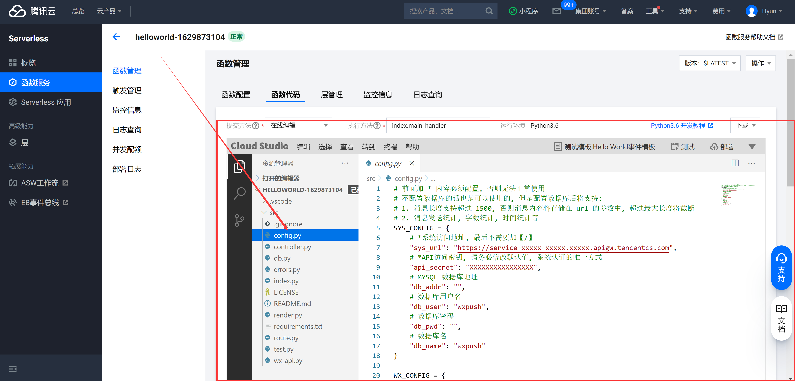

### Step15
> 配置完毕后, 打开第 11 步记录的地址, 若如图则搭建成功

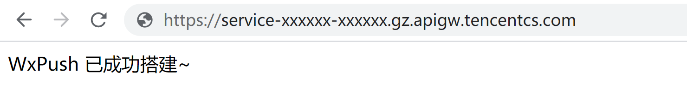